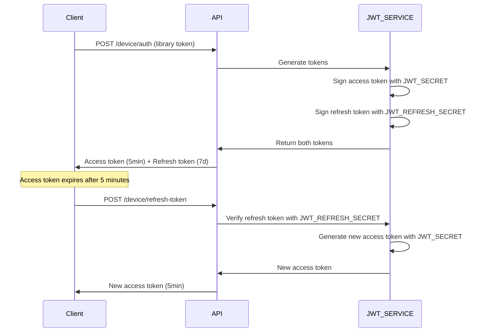

# JWT Configuration Guide

This document provides comprehensive guidance on configuring JWT tokens in the Express Learning API.

## 📋 Overview

The application uses a **dual JWT system** with separate secrets for enhanced security:

1. **Access Tokens**: Short-lived (5 minutes) for API access
2. **Refresh Tokens**: Long-lived (7 days) for token renewal

## 🔐 Environment Variables

### Required JWT Configuration

```env
# Main JWT Secret (for access tokens)
JWT_SECRET=your_super_secure_jwt_secret_key_minimum_64_characters
JWT_EXPIRES_IN=24h

# Refresh JWT Secret (MUST be different from JWT_SECRET)
JWT_REFRESH_SECRET=your_completely_different_refresh_secret_minimum_64_characters
JWT_REFRESH_EXPIRES_IN=7d
```

### 🚨 Critical Security Requirements

#### 1. Different Secrets are MANDATORY

```env
# ❌ NEVER DO THIS - Same secret is a security vulnerability
JWT_SECRET=mySecretKey123
JWT_REFRESH_SECRET=mySecretKey123

# ✅ ALWAYS DO THIS - Different secrets provide security isolation
JWT_SECRET=6f8a2b4c9e1d3f7a8b2c5d9e2f1a4b7c8d0e3f6a9b2c5d8e1f4a7b0c3d6e9f2a5b8c
JWT_REFRESH_SECRET=9a3c5f8e2b1d4a7c0f3e6b9c2d5f8a1e4b7d0c3f6e9a2c5d8f1b4e7a0d3c6f9b2e5
```

#### 2. Minimum Secret Length

- **Production**: Minimum 64 characters (128 hex characters recommended)
- **Development**: Minimum 32 characters
- **Format**: Use cryptographically secure random bytes

## 🛠️ Generating Secure Secrets

### Method 1: Node.js Crypto (Recommended)

```bash
# Generate JWT_SECRET (128 hex characters = 64 bytes)
node -e "console.log('JWT_SECRET=' + require('crypto').randomBytes(64).toString('hex'))"

# Generate JWT_REFRESH_SECRET (different from above)
node -e "console.log('JWT_REFRESH_SECRET=' + require('crypto').randomBytes(64).toString('hex'))"
```

### Method 2: OpenSSL

```bash
# Generate JWT_SECRET
openssl rand -hex 64

# Generate JWT_REFRESH_SECRET (run again for different value)
openssl rand -hex 64
```

### Method 3: Online Generator (Development Only)

⚠️ **Warning**: Never use online generators for production secrets!

For development/testing only: Use trusted generators like `https://generate-secret.vercel.app/64`

## 🔄 Token Types and Usage

### Access Tokens

- **Purpose**: API authentication and authorization
- **Lifetime**: 5 minutes (short-lived for security)
- **Signed with**: `JWT_SECRET`
- **Usage**: Include in `Authorization: Bearer <token>` header

```javascript
// Access token payload structure
{
  "appInfoId": "507f1f77bcf86cd799439011",
  "appName": "My Mobile App",
  "version": "1.2.3",
  "libraryToken": "a1b2c3d4...",
  "type": "device",
  "iat": 1697456789,
  "exp": 1697457089,
  "iss": "express_learning_api",
  "aud": "device"
}
```

### Refresh Tokens

- **Purpose**: Generate new access tokens without re-authentication
- **Lifetime**: 7 days (long-lived for user experience)
- **Signed with**: `JWT_REFRESH_SECRET`
- **Usage**: Send to `/device/refresh-token` endpoint

```javascript
// Refresh token payload structure
{
  "appInfoId": "507f1f77bcf86cd799439011",
  "appName": "My Mobile App",
  "version": "1.2.3",
  "deviceToken": "previous_device_token",
  "type": "refresh",
  "iat": 1697456789,
  "exp": 1698061589,
  "iss": "express_learning_api",
  "aud": "device"
}
```

## 🛡️ Security Benefits

### 1. Token Isolation

- Access and refresh tokens cannot be interchanged
- Different signing keys prevent cross-token attacks
- Compromising one secret doesn't affect the other token type

### 2. Reduced Attack Surface

- Access tokens expire quickly (5 minutes)
- Refresh tokens are only used for token generation
- Separate validation logic for each token type

### 3. Audit Trail

- Different token types can be logged separately
- Easier to track token usage patterns
- Better security monitoring capabilities

## 🔧 Implementation Details

### Device Authentication Flow



### Token Validation

```javascript
// Access token validation (API endpoints)
const accessToken = req.headers.authorization?.split(" ")[1];
const decoded = jwt.verify(accessToken, process.env.JWT_SECRET);

// Refresh token validation (refresh endpoint)
const refreshToken = req.body.refreshToken;
const decoded = jwt.verify(refreshToken, process.env.JWT_REFRESH_SECRET);
```

## 🚀 Production Deployment

### Environment Configuration Checklist

- [ ] `JWT_SECRET` is cryptographically secure (64+ bytes)
- [ ] `JWT_REFRESH_SECRET` is completely different from `JWT_SECRET`
- [ ] Both secrets are stored in secure environment variables
- [ ] Secrets are never committed to version control
- [ ] Access to environment variables is restricted
- [ ] Regular secret rotation policy is established

### Secret Rotation

1. **Generate new secrets** using secure methods above
2. **Update environment variables** in production
3. **Restart application** to load new secrets
4. **Monitor logs** for authentication errors
5. **Update documentation** with rotation date

### Security Monitoring

Monitor for these JWT-related security events:

- Multiple failed token validations from same IP
- Attempts to use expired refresh tokens
- Unusual token generation patterns
- Cross-token type validation attempts

## 🔍 Troubleshooting

### Common Issues

#### "Invalid or expired token" errors

**Cause**: Token signed with wrong secret or expired
**Solution**:

1. Verify `JWT_SECRET` and `JWT_REFRESH_SECRET` are set correctly
2. Check token expiration times
3. Ensure client is using correct token type for endpoint

#### Refresh token not working

**Cause**: Usually `JWT_REFRESH_SECRET` misconfiguration
**Solution**:

1. Verify `JWT_REFRESH_SECRET` is different from `JWT_SECRET`
2. Check refresh token hasn't expired (7 days)
3. Ensure refresh endpoint is using correct secret for verification

#### Token validation fails after deployment

**Cause**: Environment variables not properly set in production
**Solution**:

1. Verify all JWT environment variables are set in production
2. Restart application after updating environment variables
3. Check environment variable names match exactly

## 📚 Additional Resources

- [JWT.io](https://jwt.io/) - JWT token decoder and debugger
- [Node.js Crypto Documentation](https://nodejs.org/api/crypto.html)
- [OWASP JWT Security Cheat Sheet](https://cheatsheetseries.owasp.org/cheatsheets/JSON_Web_Token_for_Java_Cheat_Sheet.html)

---

**Last Updated**: October 16, 2025  
**Version**: 1.0.0
